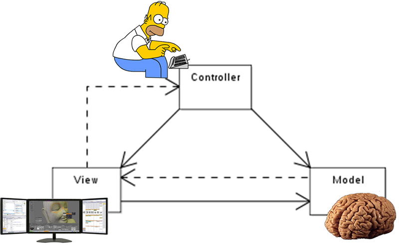
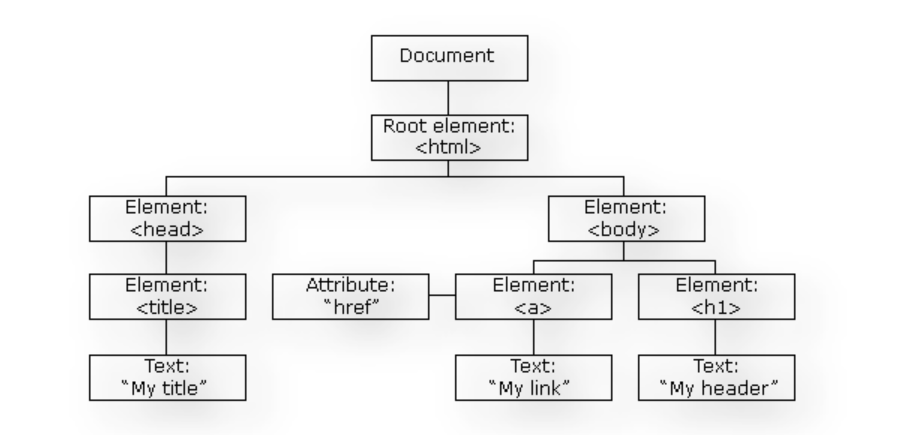
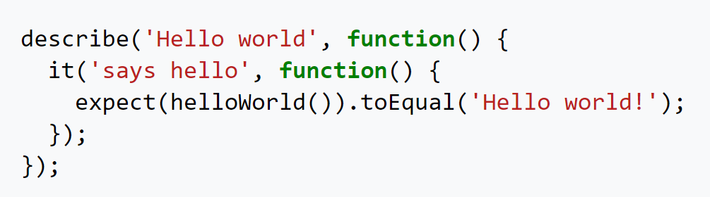

Angular Origins and Features
============================

A JavaScript framework equips us with the right tools to build web applications.
Most JS frameworks are opinionated, which means the technology defines how the app should be designed and how
the code should be organized. Google corporation first introduced Angular in 2012 with a model-view-controller [#f1]_
concept in mind, meaning it was designed using a specific pattern that interconnects the user with
the model, view, and controller. The model manages the data of the application, the view is any
representation of information such as charts, and the controller accepts input and converts it to
commands for the model or view.

Angular is written in JavaScript and introduced many features that allow developers to create
single-page applications easily. For example, Angular uses regular Document Object Model (DOM), [#f2]_ which
treats an HTML document as a tree structure in which each node represents a part of the document.
Therefore, if ten updates are made on one HTML page, Angular will simply update the entire tree structure
of tags.

With Angular, users can easily move data from JavaScript code to the view and react to user events
without manually writing code. This is thanks to Data Binding. Angular uses two-way binding.
Changes in the User Interface elements are reflected in the model state, and visa versa. Through
the controller, this allows Angular to connect the DOM to the model data. Angular also uses Jasmine, which
is a JavaScript testing framework that provides multiple functions to write different test cases.
Jasmine supports asynchronous testing, supports testing of front-end code, uses “spies” to implement
test doubles, and is easy to read. [#f3]_ This code is testing a function that prints “Hello World!” and
verifying the output.

As previously mentioned, Angular is also a full model-view-controller framework, providing an obvious
guide on how the application should be structured and provides DOM. Angular also has a feature called
Dependency Injection. Instead of fetching data from the server or validating user input, it delegates
these tasks to the services.

Angular and React
=================

Angular has a rise in demand for its framework due to its support factors, which it is known for.
Angular framework also runs on all browser environments, regardless of its platforms.
Angular is reliable because it includes robust components evolved in Juxtapose and has off-the-rack tools.
Despite these advantages, Angular does have a steep learning curve and it does not consist of extensive
documentation or a clear manual. [#f4]_

The best time to use Angular is when it is required your app be compatible
with all browsers. Angular 5.0 attracted attention due to its performance boost features and server-side
rending support services. Some aspects to consider when considering the performance between Angular and
React are packaging, learning curve, model complexity, reuse of code, and templating. Angular is limited
in controlling the packaging, making Angular more rigid compared to React, which is good for slower
loading pieces of code. As previously mentioned, Angular has a steep learning curve, so it is difficult
to master; however, react has a one way data flow, making it less time consuming for developers to
understand it. Both React and Angular are good on model complexity. Angular is better with reuse of
code because Angular has a series of ready to use elements and it is always ready to employ more elements. [#f4]_
Angular is also better for templating, as templates are not reusable.

Angular framework is a great option
for building large-scale applications with many features, but if you are building light, single-page apps,
React is the better option for that. React is also faster than Angular, due to its smaller size and faster
load times on mobile. All in all, it seems as though React will be the more popular choice in 2021 according
to Google trends, but by looking at the present job market now both are worth exploring in 2021. [#f4]_

======

.. [#f4] React vs Angular - which is best for you in 2021? [updated]. (2020, December 08). Retrieved March 05, 2021, from https://technostacks.com/blog/react-vs-angular#:~:text=React%20has%20a%20Virtual%20DOM%20which%20can%20help,are%20looking%20for%20reliable%2C%20intensive%20and%20straightforward%20programming.
.. [#f2] https://www.simplilearn.com/tutorials/angular-tutorial/what-is-angular
.. [#f3] https://www.sitepoint.com/angular-introduction/
.. [#f1] https://www.techopedia.com/definition/3842/model-view-controller-mvc